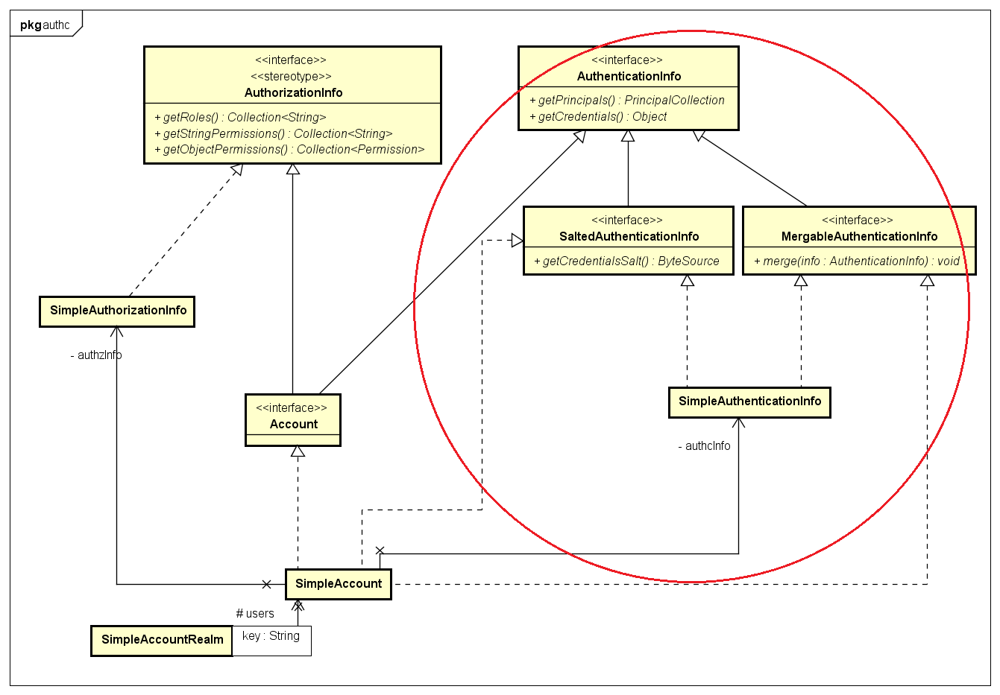

# StartFromZero-Shiro
- Subject：与当前程序交互的任何实体，不仅仅指用户（人），也可以是线程、定时任务等
- Authentication：完成身份验证
- Authorization：完成权限认证
- Realm：是一个特定安全的DAO，是shiro与程序安全数据之间连接的桥梁
- SessionManager：同HttpSession，但不仅仅依赖HttpSession。负责创建及管理用户生命周期
- CacheManager：缓存
- Cryptography：密码加密
- SecurityManager：协调各组件工作

## Subject
Subject包含了一个用户的所有安全性操作集合，包括登录/退出、鉴权等。  
DelegatingSubject是Shiro提供的Subject接口的默认实现。本质上，DelegatingSubject就是一个SecurityManager的代理，其所有的操作均通过调用SecurityManager来实现。  

## Authentication
Authentication是一个验证身份的完整过程，即证明你是谁，包括：  
- 收集用户验证信息 --> `AuthenticationToken`
- 进入Shiro身份验证 --> `Authenticator`
- 执行真正的验证工作 --> `Realm`
- 验证失败，直接抛出`AuthenticationException`
- 验证通过，返回用户信息 --> `AuthenticationInfo`

### AuthenticationToken接口
*`AuthenticationToken`* 用户登录凭证，包含两个方法:  
```java
// 首要的用户凭证，一般能够唯一标识一个用户，例如用户名、工号等
Object getPrincipal();
// 密码等凭证
Object getCredentials();
```
**1 (extends)** *`HostAuthenticationToken`* 获取用户主机信息(IP)，同`ServletRequest.getRemoteHost()`  
```java
String getHost();
```
**2 (extends)** *`RememberMeAuthenticationToken`* 是否跨session保存用户标识信息
```java
boolean isRememberMe();
```
**1.1/2.1 (implements)** `UsernamePasswordToken`实现了上面两者，提供了一般基于用户名/密码形式的验证机制  


### AuthenticationInfo接口
*`AuthenticationInfo`* 保存通过验证流程的用户的数据，而`AuthenticationToken`保存的是验证请求中、未经验证的数据  
```java
// 保存用户标识性信息，可能不仅仅是用户名，可能邮箱、手机号等也可以唯一标识一个用户
PrincipalCollection getPrincipals();
// 密码等凭证
Object getCredentials();
```
**1 (extends)** *`SaltedAuthenticationInfo`* 为了加强密码凭证的安全性，提供salt接口
```java
ByteSource getCredentialsSalt();
```
**2 (extends)** *`MergableAuthenticationInfo`* 在多Realm条件下(下面会解释)，提供合并`AuthenticationInfo`的接口
```java
void merge(AuthenticationInfo info);
```

**1.1/2.1 (implements)** `SimpleAuthenticationInfo` 实现了上面两者  

**3 (implements)** *`Account`* 融合了`AuthenticationInfo`和`AuthorizationInfo`, `SimpleAccount`是其默认实现，通过委托`SimpleAuthenticationInfo`、`SimpleAuthorizationInfo`，既提供身份鉴别功能有能提供鉴权功能
```java
public class SimpleAccount implements Account, MergableAuthenticationInfo, SaltedAuthenticationInfo, Serializable {
    private SimpleAuthenticationInfo authcInfo;
    // 委托方法
    public PrincipalCollection getPrincipals() {
        return authcInfo.getPrincipals();
    }
    public Object getCredentials() {
        return authcInfo.getCredentials();
    }
	public ByteSource getCredentialsSalt() {
        return this.authcInfo.getCredentialsSalt();
    }
    public void merge(AuthenticationInfo info) {
        authcInfo.merge(info);
        // Merge SimpleAccount specific info
        if (info instanceof SimpleAccount) {
            SimpleAccount otherAccount = (SimpleAccount) info;
            if (otherAccount.isLocked()) {
                setLocked(true);
            }
            if (otherAccount.isCredentialsExpired()) {
                setCredentialsExpired(true);
            }
        }
    }
}
```


### Authenticator接口
*`Authenticator`* 接口用于完成验证用户身份的操作，是Shiro API的入口。
```java
public interface Authenticator {
    public AuthenticationInfo authenticate(AuthenticationToken authenticationToken) throws AuthenticationException;
}
```
**1 (implements)** `AbstractAuthenticator` 所有Authenticator的抽象父类，细化了身份验证的流程，并提供了登录成功/失败以及退出的事件通知
```java
public abstract class AbstractAuthenticator implements Authenticator, LogoutAware {
    // 通知监听器
    private Collection<AuthenticationListener> listeners;
    // 实现接口方法
    public final AuthenticationInfo authenticate(AuthenticationToken token) throws AuthenticationException {
        try {
		    // 抽象出实际验证身份操作的方法
            info = doAuthenticate(token);
        } catch (Throwable t) {
		    // 当验证失败时，调用监听器通知
            notifyFailure(token, ae);
            throw ae;
        }
	    // 验证成功时，调用监听器，通知
        notifySuccess(token, info);
        return info;
    }

    // 新增退出通知
    public void onLogout(PrincipalCollection principals) {
        notifyLogout(principals);
    }
    // 完成验证工作的抽象方法
    protected abstract AuthenticationInfo doAuthenticate(AuthenticationToken token) throws AuthenticationException;
}
```

**1.1 (extends)** *`ModularRealmAuthenticator`* 结合配置的Realm(s)完成验证操作
```java
public class ModularRealmAuthenticator extends AbstractAuthenticator {
    // 实现父类抽象方法
    protected AuthenticationInfo doAuthenticate(AuthenticationToken authenticationToken) throws AuthenticationException {
        Collection<Realm> realms = getRealms();
        if (realms.size() == 1) {
		    // 只配置了一个Realm
            return doSingleRealmAuthentication(realms.iterator().next(), authenticationToken);
        } else {
		    // 配置了多个Realm
            return doMultiRealmAuthentication(realms, authenticationToken);
        }
    }
    // 多Realm的操作
    protected AuthenticationInfo doMultiRealmAuthentication(Collection<Realm> realms, AuthenticationToken token) {
        // 验证策略，AllSuccessfulStrategy、AtLeastOneSuccessfulStrategy、FirstSuccessfulStrategy可供使用
        // 不同的策略，最终表现在返回的AuthenticationInfo对象中，是合并上一步的结果还是代替等等
        AuthenticationStrategy strategy = getAuthenticationStrategy();
        AuthenticationInfo aggregate = strategy.beforeAllAttempts(realms, token)
        //　遍历Realm，执行其验证操作
        for (Realm realm : realms) {
            // 根据策略的不同，重组AuthenticationInfo
            aggregate = strategy.beforeAttempt(realm, token, aggregate);
            if (realm.supports(token)) {
                AuthenticationInfo info = null;
                Throwable t = null;
                try {
                    // 调用real，实现验证操作
                    info = realm.getAuthenticationInfo(token);
                } catch (Throwable throwable) {
                }
                // 根据策略的不同，重组AuthenticationInfo
                aggregate = strategy.afterAttempt(realm, token, info, aggregate, t);
            } else {
            }
        }
        // 根据策略的不同，重组AuthenticationInfo
        aggregate = strategy.afterAllAttempts(token, aggregate);
        return aggregate;
    }
}
```


## Authorization
鉴权，即访问控制，是对资源访问管理的过程。控制谁可以做什么。  

### AuthorizationInfo接口
*`AuthorizationInfo`* 接口保存了单个用户所拥有的角色、操作权限的信息。  
```java
public interface AuthorizationInfo extends Serializable {

    Collection<String> getRoles();

    Collection<String> getStringPermissions();

    Collection<Permission> getObjectPermissions();
}

```
**1 (implements)** `SimpleAuthorizationInfo`是 *`AuthorizationInfo`* 的简单实现。  


### Authorizer接口
*`Authorizer`* 接口为用户提供鉴权操作。  
```java
public interface Authorizer {
	boolean isPermitted(PrincipalCollection principals, String permission);
	boolean isPermitted(PrincipalCollection subjectPrincipal, Permission permission);
	boolean[] isPermitted(PrincipalCollection subjectPrincipal, String... permissions);
	boolean[] isPermitted(PrincipalCollection subjectPrincipal, List<Permission> permissions);
	boolean isPermittedAll(PrincipalCollection subjectPrincipal, String... permissions);
	boolean isPermittedAll(PrincipalCollection subjectPrincipal, Collection<Permission> permissions);
	void checkPermission(PrincipalCollection subjectPrincipal, String permission) throws AuthorizationException;
	void checkPermission(PrincipalCollection subjectPrincipal, Permission permission) throws AuthorizationException;
	void checkPermissions(PrincipalCollection subjectPrincipal, String... permissions) throws AuthorizationException;
	void checkPermissions(PrincipalCollection subjectPrincipal, Collection<Permission> permissions) throws AuthorizationException;
	boolean hasRole(PrincipalCollection subjectPrincipal, String roleIdentifier);
	boolean[] hasRoles(PrincipalCollection subjectPrincipal, List<String> roleIdentifiers);
	boolean hasAllRoles(PrincipalCollection subjectPrincipal, Collection<String> roleIdentifiers);
	void checkRole(PrincipalCollection subjectPrincipal, String roleIdentifier) throws AuthorizationException;
	void checkRoles(PrincipalCollection subjectPrincipal, Collection<String> roleIdentifiers) throws AuthorizationException;
	void checkRoles(PrincipalCollection subjectPrincipal, String... roleIdentifiers) throws AuthorizationException; 
}
```
*注意*：以check开头的鉴权方法，如果没有指定的权限将会抛出AuthorizationException异常。  


## Realm
*`Realm`* 是一个系统安全组件，可以访问特定系统的安全部件，包括用户、角色、权限等。*`Realm`* 可以在Authentication和Ahthorization流程中工作。  
```java
public interface Realm {
    // 全局唯一的名称
    String getName();
    //验证前先判断是否支持该AuthenticationToken，否则不进行验证
    boolean supports(AuthenticationToken token);
    // 执行真正的验证工作
    AuthenticationInfo getAuthenticationInfo(AuthenticationToken token) throws AuthenticationException;
}
```
**1 (implements)** `CachingRealm` 基本的Realm抽象实现，提供cache功能  
**1.1 (extends)** `AuthenticatingRealm` 在登录流程中提供用户身份验证功能，一般登录实现继承该抽象类即可  
```java
public final AuthenticationInfo getAuthenticationInfo(AuthenticationToken token) throws AuthenticationException {
    AuthenticationInfo info = getCachedAuthenticationInfo(token);
    if (info == null) {
        // 抽象出真正实现验证工作的接口，需子类实现
        info = doGetAuthenticationInfo(token);
        if (token != null && info != null) {
            cacheAuthenticationInfoIfPossible(token, info);
        }
    }
    if (info != null) {
        assertCredentialsMatch(token, info);
    }
    return info;
}
 /**
 * 依赖子类实现
 * 该方法一般只需要从数据库中取出待验证的用户信息，剩下的工作如登录等交给Shiro完成。
*/
protected abstract AuthenticationInfo doGetAuthenticationInfo(AuthenticationToken token) throws AuthenticationException;
```
**1.1.1 (extends)** `AuthorizingRealm`继承了Authentication的衣钵，又融合了Authorization的鉴权功能  
```java
public abstract class AuthorizingRealm extends AuthenticatingRealm
        implements Authorizer, Initializable, PermissionResolverAware, RolePermissionResolverAware
```
**1.1.1.1 (extends)** `SimpleAccountRealm`  
**1.1.1.1.1 (extends)** `IniRealm`  


## SessionManager  
Shiro提供了一套完整的企业级Session管理机制。其适用于所有程序，而不依赖Web容器或EJB。  
*`SessionManager`* 接口负责创建、维护、清理应用中的所有session。  

## SecurityManager  
*`SecurityManager`* 接口集成了所有的安全性操作。通过继承 *`Authenticator`* 、*`Authorizer`* 、*`SessionManager`* 接口，简化了应用程序配置，便于使用。  
```java
public interface SecurityManager extends Authenticator, Authorizer, SessionManager {    
    Subject login(Subject subject, AuthenticationToken authenticationToken) throws AuthenticationException;
    void logout(Subject subject);    
    Subject createSubject(SubjectContext context);
}
```
**1 (implements)** `CachingSecurityManager`  
`CachingSecurityManager` 提供缓存支持。  
```java
public abstract class CachingSecurityManager implements SecurityManager, Destroyable, CacheManagerAware, EventBusAware {
    private CacheManager cacheManager;
    private EventBus eventBus;
}
```

**1.1 (extends)** `RealmSecurityManager`  
`RealmSecurityManager` 集成Realm。  
```java
public abstract class RealmSecurityManager extends CachingSecurityManager {
    private Collection<Realm> realms;
}
```

**1.1.1 (extends)** `AuthenticatingSecurityManager`  
`AuthenticatingSecurityManager` 通过委托`Authenticator`，提供身份验证的功能。  
```java

public abstract class AuthenticatingSecurityManager extends RealmSecurityManager {
    private Authenticator authenticator;
}
```

**1.1.1.1 (extends)** `AuthorizingSecurityManager`  
`AuthorizingSecurityManager` 通过委托`Authorizer`，提供鉴权功能。  
```java
public abstract class AuthorizingSecurityManager extends AuthenticatingSecurityManager {
    private Authorizer authorizer;
}
```

**1.1.1.1.1 (extends)** `SessionsSecurityManager`  
`SessionsSecurityManager` 通过委托`SessionManager`，提供session管理功能。  
```java
public abstract class SessionsSecurityManager extends AuthorizingSecurityManager {
    private SessionManager sessionManager;
}
```

**1.1.1.1.1.1 (extends)** `DefaultSecurityManager`  
`DefaultSecurityManager` Shiro默认提供的一个完整的SecurityManager实现。  
```java
public class DefaultSecurityManager extends SessionsSecurityManager {
    protected RememberMeManager rememberMeManager;
    protected SubjectDAO subjectDAO;
    protected SubjectFactory subjectFactory;
}
```
