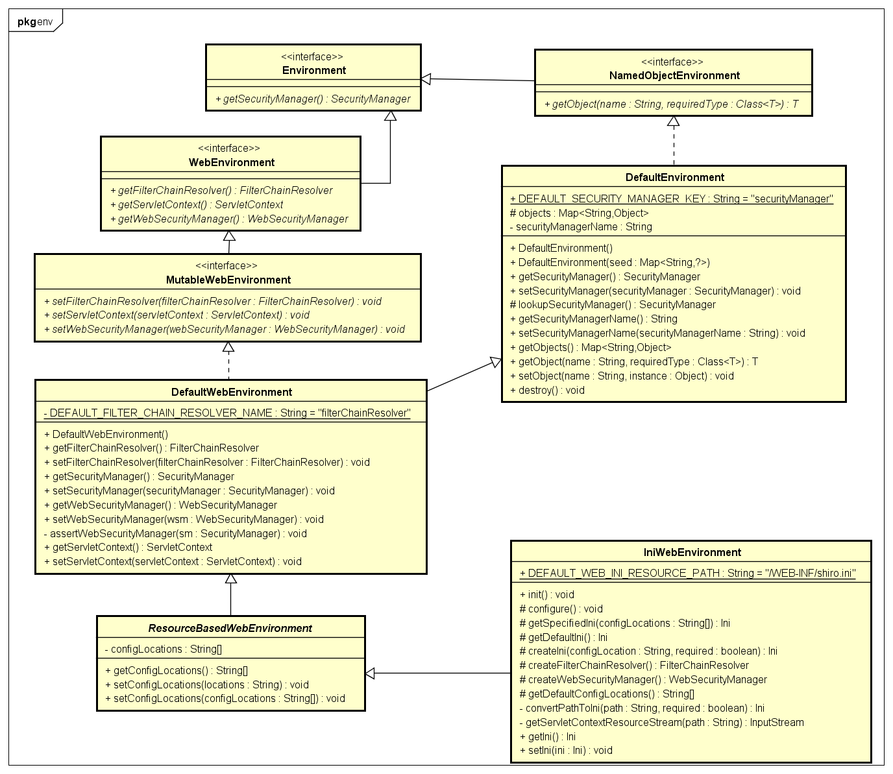
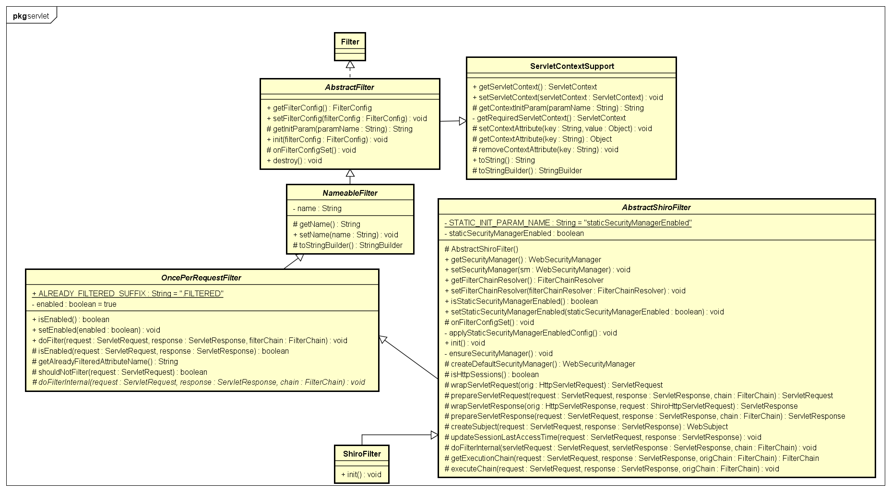
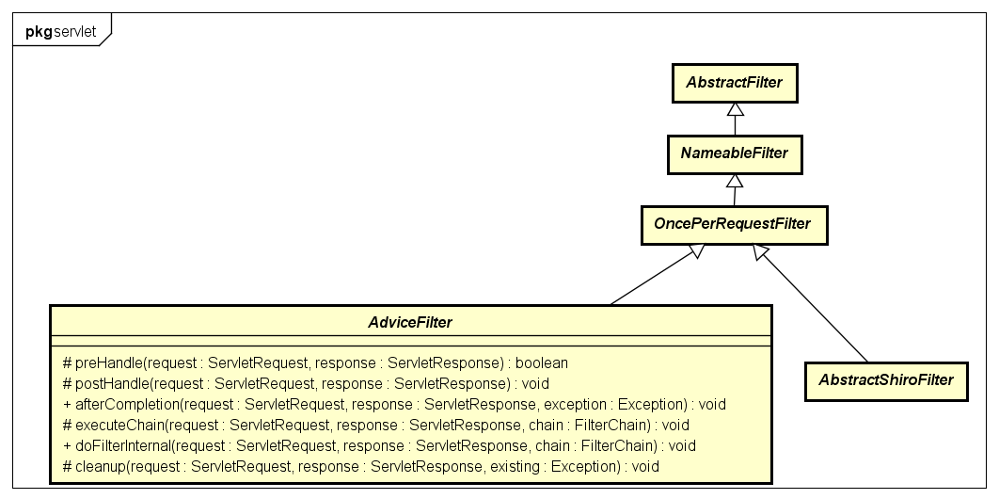
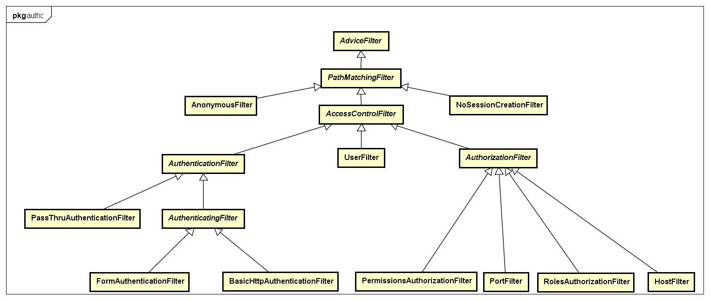
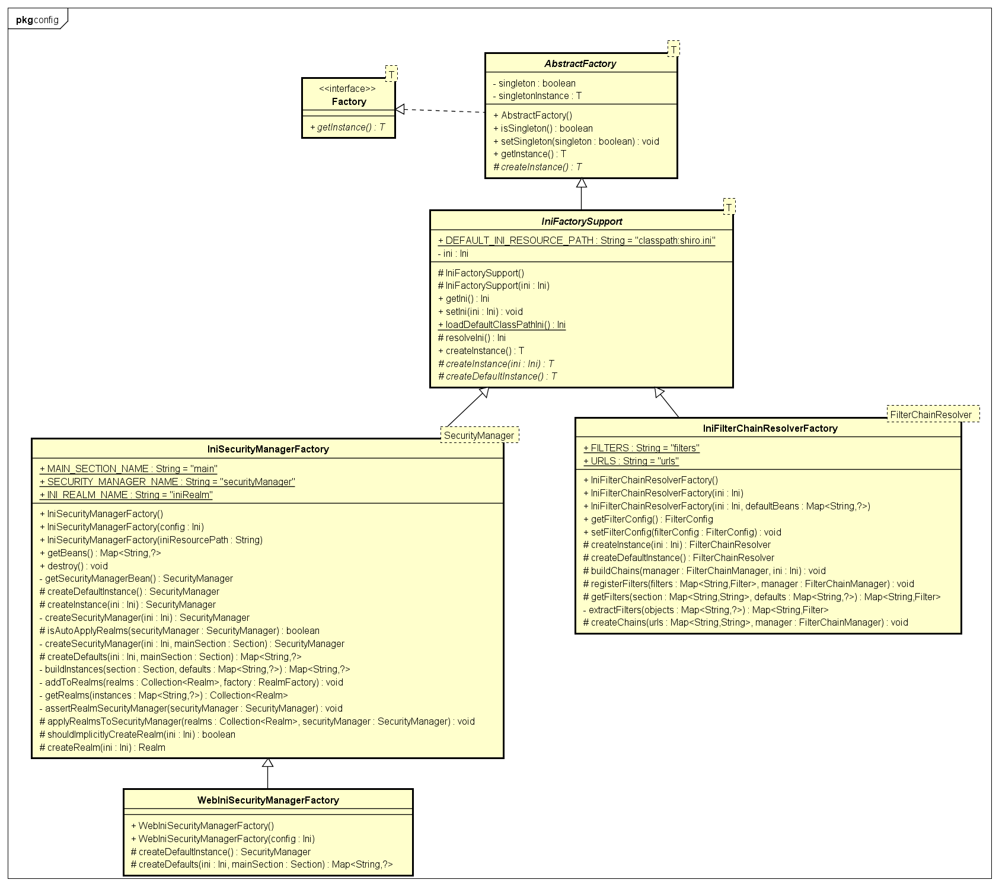

# Shiro Web

## 基本构件
### 1 Environment 
Environment对象是Shiro功能的基础，一般由解析配置文件生成。其包含了所有Shiro所需的功能性组件。
#### 1.1 NamedObjectEnvironment
NamedObjectEnvironment提供通过name查找Shiro组件对象的机制。
##### 1.1.1 DefaultEnvironment
Environment接口的简单实现，提供基于key-value形式的对象存储。key为对象名，value为对象本身。
#### 1.2 WebEnvironment
Web环境特定下的Environment，新增访问FilterChainResolver、ServletContext、WebSecurityManager的API（getter/读操作）。
##### 1.2.1 MutableWebEnvironment
在WebEnvironment的基础上增加设置FilterChainResolver、ServletContext、WebSecurityManager的API（setter/写操作）
###### 1.2.1.1 DefaultWebEnvironment
默认WebEnvironment的实现。
####### 1.2.1.1.1 ResourceBasedWebEnvironment
通过配置文件路径初始化WebEnvironment。
######## 1.2.1.1.1.1 IniWebEnvironment
基于Ini格式配置文件初始化的WebEnvironment。  



### 2 EnvironmentLoader
EnvironmentLoader是一个简单的Java类，负责在web容器启动时创建WebEnvironment对象，并存放在ServletContext中。  
WebEnvironment对象包含WebSecurityManager对象。  
#### 2.1 EnvironmentLoaderListener
EnvironmentLoaderListener是EnvironmentLoader的扩展，核心功能仍由EnvironmentLoader提供，但实现了ServletContextListener接口，能够在Web容器启动或关闭时创建或销毁WebEnvironment对象。

### 3 Shiro Filter
Shiro web的验证基于Filter实现。ShiroFilter拦截所有请求，是Shiro验证机制的入口。  
#### 3.1 AbstractFilter
AbstractFilter是Filter的简单实现，是Shiro 所有Filter的基类。仅保存了FilterConfig对象并提供了获取初始参数的方法getInitParam(), 具体的逻辑需要子类实现onFilterConfigSet()抽象方法。此外doFilter方法也需要子类实现。
##### 3.1.1 NameableFilter
NameableFilter为Filter命名，如果没有显示指定，则默认使用在web.xml中配置的名称。

###### 3.1.1.1 OncePerRequestFilter
OncePerRequestFilter 实现了doFilter()方法，用于处理每一次请求，并按照规则分发到Shiro特定的Filter中，具体需要子类实现doFilterInternal()方法。  

####### 3.1.1.1.1 AbstractShiroFilter
AbstractShiroFilter 基本实现了所有Shiro Filter的标准行为，子类仅需要实现特定的配置逻辑，重写init()方法即可。  

######## 3.1.1.1.1.1 ShiroFilter
最基本的、可用的Shiro Filter。  
需要配置在web.xml中，拦截所有请求。  
此外，ShiroFilter需要依赖WebEnvironment的配置信息，所以必须在web.xml中配置EnvironmentLoaderListener，在容器启动时创建WebEnvironment对象。  
  

####### 3.1.1.1.2 AdviceFilter
AdviceFilter提供了类似AOP环绕增强的机制，方便在请求过滤器链处理前(preHandle)、处理后(postHandle)和完成后(afterCompletion)添加具体的逻辑。具体请看doFilterInternal()方法的实现：  
``` java
public void doFilterInternal(ServletRequest request, ServletResponse response, FilterChain chain)
            throws ServletException, IOException {
    Exception exception = null;
        try {
			// 请求处理前，preHandler作为前置验证
            boolean continueChain = preHandle(request, response);
            if (continueChain) {
				// 实际执行过滤器链
                executeChain(request, response, chain);
            }
			// 过滤器链执行后
            postHandle(request, response);
        } catch (Exception e) {
            exception = e;
    } finally {
		// 在cleanup方法中调用afterCompletion()
        cleanup(request, response, exception);
    }
}
```
  

### 4 Shiro Default Filter
接下来介绍的几个Filter是Shiro Filter继承体系中的成员，是完成Shiro机制的默认Filter，但为了避免文档结构层次过多，特单独抽取出来。

#### 4.1 PathMatchingFilter
基于匹配请求URL的过滤器，匹配的请求将会被Shiro继续处理，否则直接通过该过滤器。  
```java
protected boolean preHandle(ServletRequest request, ServletResponse response) throws Exception {
    if (this.appliedPaths == null || this.appliedPaths.isEmpty()) {
        return true;
    }

    for (String path : this.appliedPaths.keySet()) {
        // If the path does match, then pass on to the subclass implementation for specific checks
        //(first match 'wins'):
        if (pathsMatch(path, request)) {
            Object config = this.appliedPaths.get(path);
            return isFilterChainContinued(request, response, path, config);
        }
    }
    //no path matched, allow the request to go through:
    return true;
}

private boolean isFilterChainContinued(ServletRequest request, ServletResponse response,
                                           String path, Object pathConfig) throws Exception {
    if (isEnabled(request, response, path, pathConfig)) { //isEnabled check added in 1.2
        //The filter is enabled for this specific request, so delegate to subclass implementations
        //so they can decide if the request should continue through the chain or not:
		// onPreHandle依赖子类具体实现
        return onPreHandle(request, response, pathConfig);
    }
    //This filter is disabled for this specific request,
    //return 'true' immediately to indicate that the filter will not process the request
    //and let the request/response to continue through the filter chain:
    return true;
}
```

##### 4.1.1 AccessControlFilter
AccessControlFilter控制资源访问的超类Filter，如果用户是未经身份认证的，则保存当前请求信息，并跳转到登录页面(saveRequestAndRedirectToLogin)。  
```java
/**
* 返回true如果isAccessAllowed()返回true，否则返回onAccessDenied()的返回值
*/
public boolean onPreHandle(ServletRequest request, ServletResponse response, Object mappedValue) throws Exception {
	// isAccessAllowed()、onAccessDenied()均为抽象方法    
	return isAccessAllowed(request, response, mappedValue) || onAccessDenied(request, response, mappedValue);
}

protected void saveRequestAndRedirectToLogin(ServletRequest request, ServletResponse response) throws IOException {
    saveRequest(request);
    redirectToLogin(request, response);
}
```

###### 4.1.1.1 AuthenticationFilter
完成用户身份验证功能的Filter，作为基类，仅实现了检查用户是否已经验证通过的逻辑，至于没有验证的处理逻辑需要子类完成。  

####### 4.1.1.1.1 AuthenticatingFilter
AuthenticationFilter可以处理用户验证逻辑的请求(登录请求)。  

###### 4.1.1.2 AuthorizationFilter
鉴权过滤器的基类，提供未通过鉴权的请求的后续处理操作。  

####### 4.1.1.2.1 PermissionsAuthorizationFilter
验证当前用户是否拥有访问某资源的权限。  

####### 4.1.1.2.2 RolesAuthorizationFilter
验证当前用户是否拥有指定角色。  

  


## Tips
Shiro内部对工厂模式的使用案例：
  
充分运用Java特性，首先抽象出一个工厂接口Factory<T>，继而实现统一的工厂方法，层层递进，一步步重用公共代码，下放具体接口，直到具体实现。代码层次清晰，便于扩展。  


~ 未完，待续 ~